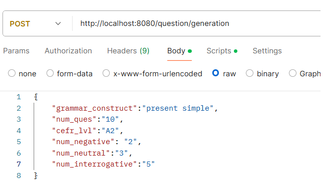

# AIEDproject
Our final project for winter '24 seminar of Education system design with AI. We developed a servlet which could extend the ARES I-CALL system which uses an LLM to generate practice exercises for grammar forms students encounter in texts.  

## Running the Servlet Locally
To run the servlet locally you will need your own docker-compose.yml file in the root directory of the project. **To protect your API key this file should be added to the .gitignore file of your repository**. The structure of  **docker-compose.yml** file should look like this. 
```yaml
services:
  jetty:
    image: aiedproject
    container_name: aied-container
    build: .
    ports:
      - "8080:8080"
    volumes:
      - ./target/AIEDproject-1.0-SNAPSHOT.war:/opt/jetty-base/webapps/ROOT.war
    environment:
      - GROQ_API_KEY=your api key here
      - JETTY_PORT=8080
  restart: unless-stopped
```

to build and then deploy the container, navigate to the project directory in your terminal and run the following command:

```yaml
docker-compose up --build -d
```
to stop the container run the following command:
```yaml
docker-compose down
```

## Recompiling the project after changes
If changes have been made to the code in the project you will need to recompile it by running the following command in the main directory of the project: 
```yaml
mvn clean package
```
from here you will then redeploy the container as given in the instructions above.

## Testing in Postman
Test **POST** requests to the language model can be sent through the postman desktop app to the following url:

```yaml
http://localhost:8080/question/generation
```
Parameters for the request are input in JSON format through the body of the request in postman as shown in the screenshot below:

{

    "grammar_construct":"present simple",
    "num_ques":"10",
    "cefr_lvl":"A2",
    "num_negative": "2",
    "num_neutral":"3",
    "num_interrogative":"5"
    
}

after hitting send, the raw model response should appear in the lower window. 

## Error Logs
For debugging error logs can be found in the console by typing the following command:
```yaml
docker-compose logs
```
